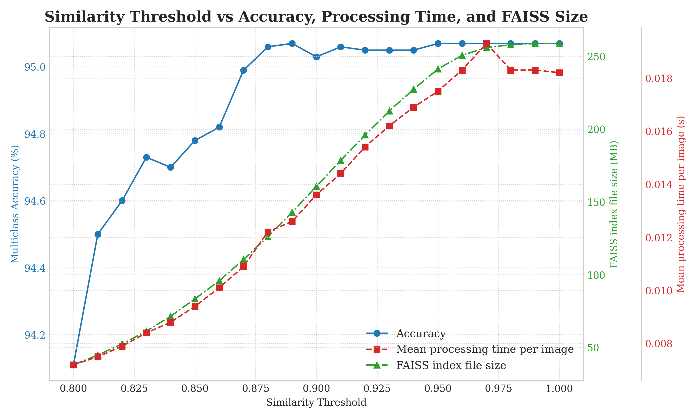

# ResNet50 trained with SCL

This repository contains code and documentation for training ResNet50 with Supervised Contrastive Learning.

## Files description

| SCRIPT                                	| AIM                                                         	    |
|---------------------------------------	|---------------------------------------------------------------	|
| 01_yang_split_dataset_cosine.py       	| Split dataset into 80-20 (train, val).                      	    |
| 01_yang_split_dataset_linear_head.py  	| Split dataset into 75-15-15 (train, val, test).             	    |
| 02_mean_std_variables.py              	| Compute mean and std values for images normalization.       	    |
| 03_count_classes.py                   	| Visualize the number of instances per class in a dataset.   	    |
| 04_lut_creation.py                    	| Create a LUT based on feature vectors of 2048 length.       	    |
| 05_lut_pruning.py                     	| Prune the previous created LUT based on a THRESHOLD.        	    |
| 06_inference.py                       	| Perform the inference on the test set using the pruned LUT. 	    |
| 07_run_threshold_experiments.py           | Test metrics depending on different SIMILARITY_THRESHOLD values.  |
| 08_thresholds_comparison.py               | Plot model accuracy versus SIMILARITY_THRESHOLD values.           |

## Documentation

| File | Description |
|------|-------------|
| [Tasks](docs/tasks.md) | Project tasks tracking - completed and pending items |
| [CNN Model](docs/cnn_model.md) | Details about the CNN model training methodology and results |
| [Environment Configuration](docs/environment.md) | Instructions for setting up the Python environment |
| [Cheat Sheets](docs/cheat_sheets.md) | Git commands, naming conventions, and other helpful tips |

## Results

