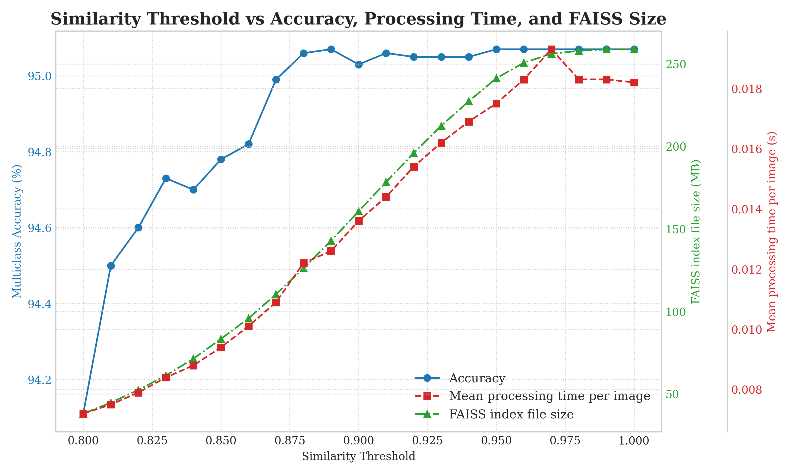
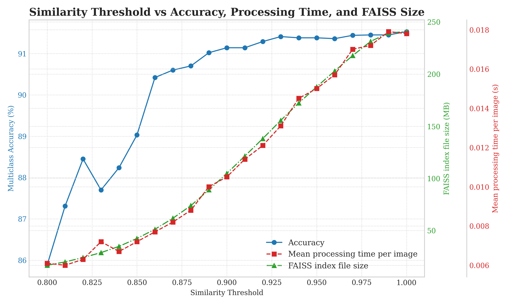

# ResNet50 trained with SCL

This repository contains code and documentation for training ResNet50 with Supervised Contrastive Learning.

## Files description

| SCRIPT                                	| AIM                                                         	    |
|---------------------------------------	|---------------------------------------------------------------	|
| 01_yang_split_dataset_cosine.py       	| Split dataset into 80-20 (train, val).                      	    |
| 01_yang_split_dataset_linear_head.py  	| Split the dataset into 75-15-15 (train, validation, test).   	    |
| 02_mean_std_variables.py              	| Compute mean and std deviation values for image normalization.    |
| 03_count_classes.py                   	| Visualize the number of instances per class in the dataset.  	    |
| 04_lut_creation.py                    	| Create a LUT based on feature vectors of length 2048.        	    |
| 05_lut_pruning.py                     	| Prune the previously created LUT based on a THRESHOLD.       	    |
| 06_inference.py                       	| Perform inference on the test set using the pruned LUT.      	    |
| 07_run_threshold_experiments.py           | Generate metrics for various SIMILARITY_THRESHOLD values.         |
| 08_thresholds_comparison.py               | Plot model accuracy against different SIMILARITY_THRESHOLD values.|

## Documentation

| File                                             | Description                                                   |
|------------------------------------------------- |---------------------------------------------------------------|
| [Tasks](docs/tasks.md)                           | Project tasks tracking - completed and pending items          |
| [CNN Model, stage 1](docs/cnn_model.md)          | Details about the CNN model training methodology and results  |
| [CNN Model, stage 2](docs/cnn_sam2.md)           | Details about the CNN model trained with the segmented masks  |
| [Environment Configuration](docs/environment.md) | Instructions for setting up the Python environment            |
| [Cheat Sheets](docs/cheat_sheets.md)             | Git commands, naming conventions, and other helpful tips      |

## Results

Selected **SIMILARITY_THRESHOLD** value of 0.89 for stage-1, as determined from the comparison shown in the figure below:



```json
  "0.88": {
    "Multiclass Accuracy": 95.06,
    "Mean processing time per image (seconds)": 0.0122,
    "FAISS index file size (MB)": 126.13
  },
  "0.89": {
    "Multiclass Accuracy": 95.07,
    "Mean processing time per image (seconds)": 0.0126,
    "FAISS index file size (MB)": 142.84
  },
  "0.9": {
    "Multiclass Accuracy": 95.03,
    "Mean processing time per image (seconds)": 0.0136,
    "FAISS index file size (MB)": 160.7
  },
```

Selected **SIMILARITY_THRESHOLD** value of 0.90 for stage-2, as determined from the comparison shown in the figure below:



```json
 "0.89": {
    "Multiclass Accuracy": 91.27,
    "Multiclass Precision (macro)": 83.27,
    "Multiclass Recall (macro)": 80.54,
    "Multiclass F1 Score (macro)": 80.65,
    "Total elapsed time (seconds)": 70.34,
    "Mean processing time per image (seconds)": 0.0119,
    "FAISS index file size (MB)": 130.13,
    "Gini Coefficient": 0.685,
    "Imbalance Ratio": 703.333,
    "Entropy": 3.543
  },
  "0.9": {
    "Multiclass Accuracy": 91.32,
    "Multiclass Precision (macro)": 82.45,
    "Multiclass Recall (macro)": 80.24,
    "Multiclass F1 Score (macro)": 80.38,
    "Total elapsed time (seconds)": 72.99,
    "Mean processing time per image (seconds)": 0.0123,
    "FAISS index file size (MB)": 140.23,
    "Gini Coefficient": 0.686,
    "Imbalance Ratio": 766.0,
    "Entropy": 3.544
  },
  "0.91": {
    "Multiclass Accuracy": 91.27,
    "Multiclass Precision (macro)": 82.65,
    "Multiclass Recall (macro)": 80.04,
    "Multiclass F1 Score (macro)": 80.49,
    "Total elapsed time (seconds)": 75.91,
    "Mean processing time per image (seconds)": 0.0128,
    "FAISS index file size (MB)": 149.89,
    "Gini Coefficient": 0.687,
    "Imbalance Ratio": 612.25,
    "Entropy": 3.545
  },
```